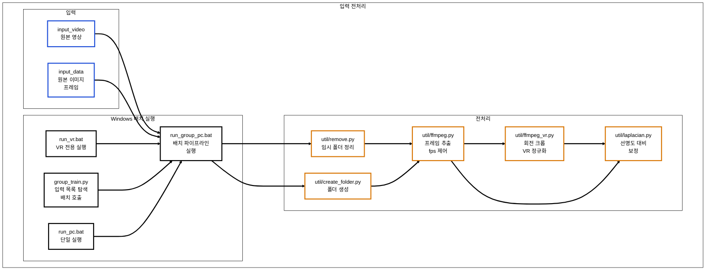

# 🎨 Korean-style 3D Gaussian Splatting Pipeline


> **영상/이미지 입력으로부터 3D Gaussian Splatting(3DGS) 기반 3D 장면을 재구성하고, CycleGAN 계열 스타일 변환을 결합해 “한국화 스타일 3D 결과물(PLY/SPLAT/MP4)”을 생성하는 End-to-End 자동화 파이프라인 프로젝트입니다.**

<br/>

## 📸 Project Showcase


<br/>

## 📝 Introduction
본 프로젝트는 3D 재구성(3D Gaussian Splatting) 과 2D 스타일 변환(CycleGAN 계열) 을 하나의 워크플로우로 묶어,
입력 데이터(영상/프레임)를 넣으면 전처리 → 스타일링 → COLMAP 기반 재구성 → 3DGS 학습 → 결과 저장까지 자동으로 수행합니다.

### Key Features
- **Batch Orchestration (Windows .bat)**: 데이터별 반복 실행을 위한 배치 파이프라인 구성 (run_group_pc.bat)
- **Frame Preprocessing**: ffmpeg 기반 fps 제어 프레임 추출 + VR 입력 회전/크롭 정규화 + 선명도/대비 보정
- **Style Transfer (CycleGAN)**: 스타일 추론 및 후처리(마스크/침식/블러)로 입력 이미지 품질 정리
- **3D Reconstruction (COLMAP + 3DGS)**: convert.py로 sparse 생성 후 train.py로 3DGS 학습
- **Structured Outputs**: PLY/SPLAT/MP4 산출물을 목적별 디렉터리로 분리 관리

<br/>

## 🏗 System Architecture (Data Pipeline)

1) 입력/오케스트레이션/전처리



2) 스타일 변환/3D 재구성/출력

```mermaid
%%{
  init: {
    'flowchart': { 'nodeSpacing': 50, 'rankSpacing': 100, 'arrowMarkerAbsolute': true, 'arrowMarkerSize': 20 },
    'theme': 'base',
    'themeVariables': {
      'primaryColor': '#ffffff',
      'primaryTextColor': '#000000',
      'primaryBorderColor': '#000000',
      'lineColor': '#000000',
      'secondaryColor': '#ffffff',
      'tertiaryColor': '#ffffff',
      'background': '#ffffff',
      'mainBkg': '#ffffff',
      'nodeBorder': '#000000',
      'clusterBkg': '#ffffff',
      'clusterBorder': '#000000',
      'defaultBkg': '#ffffff',
      'titleColor': '#000000',
      'edgeLabelBackground':'#ffffff',
      'fontSize': '16px'
    }
  }
}%%

flowchart LR

classDef PreStyle fill:#ffffff,stroke:#d97706,stroke-width:3px,color:#000000;
classDef MLStyle fill:#ffffff,stroke:#16a34a,stroke-width:3px,color:#000000;
classDef OutputStyle fill:#ffffff,stroke:#7c3aed,stroke-width:3px,color:#000000;

subgraph Lane2["스타일 변환<br/>3D 재구성 출력"]
direction LR

subgraph StyleTransfer["스타일 변환<br/>CycleGAN 계열"]
direction LR
StTest["styleTransfer/test.py<br/>스타일 추론"]:::MLStyle
StConvert["styleTransfer/test_convert.py<br/>마스크 후처리"]:::MLStyle
StConvert2["styleTransfer/test_convert_2.py<br/>결과 정리"]:::MLStyle
end

subgraph Retarget["입력 리타게팅<br/>3DGS 포맷 정합"]
direction TB
PilPy["util/pil.py<br/>root 기준 정합<br/>input 구성"]:::PreStyle
end

subgraph GaussianSplatting["3D 재구성<br/>(3D Gaussian Splatting)"]
direction LR
GsConvert["gaussian-splatting/convert.py<br/>COLMAP sparse"]:::MLStyle
GsTrain["gaussian-splatting/train.py<br/>3DGS 학습"]:::MLStyle
GsSave["gaussian-splatting/scene/save<br/>PLY SPLAT 저장"]:::MLStyle
end

subgraph Outputs["출력"]
direction TB
OutputList["output_list<br/>PLY 목록"]:::OutputStyle
OutputData["output_data<br/>산출물"]:::OutputStyle
OutputMp4["output_data/*.mp4<br/>렌더 결과"]:::OutputStyle
end

end

StTest --> StConvert --> StConvert2
StConvert2 --> PilPy
PilPy --> GsConvert --> GsTrain --> GsSave
GsSave --> OutputList
GsSave --> OutputData
OutputData --> OutputMp4

linkStyle default stroke-width:3px,stroke:black;

```




## 🛠 Tech Stack

| Category              | Technology                    | Description                |
| --------------------- | ----------------------------- | -------------------------- |
| **Orchestration**     | Windows Batch (.bat)          | 배치 실행/옵션 분기/폴더 규약 기반 자동화   |
| **Language**          | Python 3.8+                   | 전처리/스타일/파이프라인 제어           |
| **Preprocess**        | ffmpeg, OpenCV, Pillow        | fps 제어 프레임 추출, 이미지 보정/리사이즈 |
| **Style Transfer**    | PyTorch (CycleGAN 계열)         | 스타일 추론 및 후처리               |
| **3D Reconstruction** | COLMAP, 3D Gaussian Splatting | sparse 생성 + 3DGS 학습        |
| **GPU**               | CUDA 11.8+                    | 학습 가속                      |

<br/>

## 📂 Implementation Details

### 1. DEM to Heightmap Conversion
* group_train.py가 입력 목록을 탐색하고, run_group_pc.bat를 호출해 데이터 단위 배치 실행을 수행합니다.
* VR 입력 여부, fps, iteration 등의 실행 옵션을 배치 인자로 전달해 실험 조건을 표준화합니다.

### 2. Frame Preprocessing
* ffmpeg로 프레임을 추출하고(fps 제어), VR 입력은 회전/크롭으로 정규화합니다.
* 라플라시안 기반 보정으로 입력 선명도를 개선하여 후단 학습 품질을 안정화합니다.

### 3. Style Transfer + 3DGS Integration
* CycleGAN 계열 스타일 추론 결과를 후처리한 뒤, pil.py로 3DGS 입력 포맷에 맞게 리타게팅합니다.
* COLMAP 기반 sparse 생성 후, 3DGS 학습으로 PLY/SPLAT 및 렌더 결과를 생성합니다.
  
<br/>

## 🧩 What I Built (기술 구현 요약)
* 배치 기반 자동 실행 구조: 전처리→스타일→3D 재구성을 단일 파이프라인으로 연결
* 입력 정규화/보정 모듈: fps 제어, VR 프레임 정규화, 선명도·대비 보정
* 스타일링 결과의 3DGS 연동: 스타일 추론 결과를 3DGS 학습 입력으로 변환 및 산출물 정리
  
<br/>

## 🏆 Project Outcomes
* 가상의 디자인이 아닌 **실측 데이터 기반의 디지털 트윈(Digital Twin) 구축 프로세스**를 확립했습니다.
* 실제 골프장과 지형적 특성이 동일한 시뮬레이션 환경을 구축하여 현실적인 난이도 밸런싱을 구현했습니다.

<br/>

## 🚀 How to Run
프로젝트 특성상 CUDA/Visual Studio/COLMAP 등 설치가 필요합니다. 아래는 “구조를 이해하고 실행하는” 기준의 최소 안내입니다.
1. Clone this repository.
 ```bash
  git clone https://github.com/wns5255/korean-style-3d-gaussian-splatting.git
  cd korean-style-3d-gaussian-splatting
 ```

2. (권장) Conda 환경 준비
 ```bash
  conda create -n gaussian_splatting python=3.8 -y
  conda activate gaussian_splatting
 ```

3. 입력 넣기
  * input_video/ 또는 input_data/에 데이터 배치

4. 실행
  * 배치 실행: run_group_pc.bat
  * 단일 실행: run_pc.bat
  * VR 실행: run_vr.bat
    
<br/>

## ⚠️ Notes
일부 경로/환경 변수는 로컬 개발 환경 기준으로 고정되어 있을 수 있습니다.
(포팅을 위해서는 경로를 config/env로 분리하는 리팩토링을 권장합니다.)

<br/>

## ⚖️ License

**Copyright (c) Soongsil University. All Rights Reserved.**

This project was developed as part of a curriculum or research at **Soongsil University**.
The intellectual property and copyright of this software belong to **Soongsil University**.
Unauthorized commercial use or distribution is prohibited.
